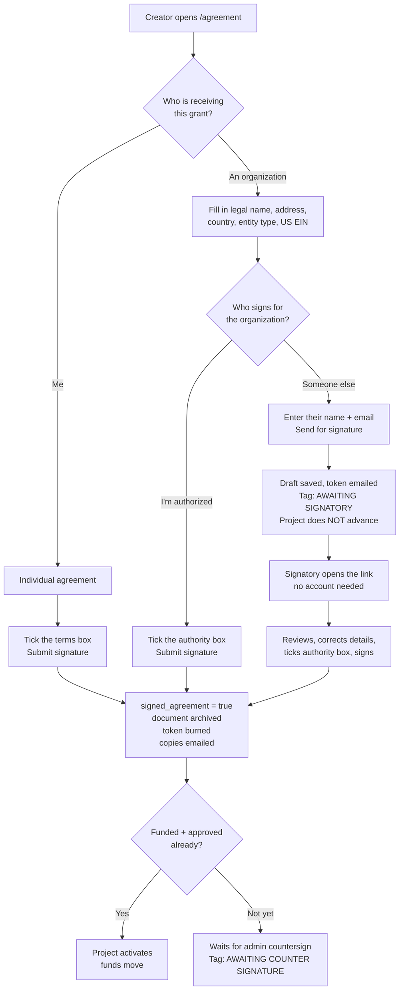

# Org & fiscal-sponsor grant agreements

_Written 2026-07-25._

Plan for letting a grant agreement be made out between Manifold for Charity and
an **organization**, rather than always the individual who created the project.

Two cases to support:

1. **Alice → Acme.** Alice creates a proposal for her org Acme. Acme should be
   the named Recipient, and Alice signs on Acme's behalf as an authorized
   representative.
2. **Alice → Cherry (fiscal sponsor).** Alice or Acme is fiscally sponsored by
   Cherry. Cherry is the contracting party and receives the funds; Carol at
   Cherry must be the one who actually signs, and Carol may have no Manifund
   account.

Decisions already made (see "Decisions" at the bottom for the full list): the
fiscal sponsor is the named Recipient; a third-party signatory signs via an
emailed link; the org agreement is a **separate document**, not a conditional
branch of the existing one; entity legal name, address and EIN are required at
signing, while W-9/W-8 and determination letters stay out-of-band and are only
flagged in the DB.

---

## Current state

- `app/projects/[slug]/agreement/page.tsx` renders `GrantAgreement` +
  `SignatureSection`. The page is **publicly viewable** — no auth check.
- `grant-agreement.tsx:29` hardcodes §1.2 Recipient to
  `project.profiles.full_name`.
- `pages/api/sign-grant-agreement.ts:18` allows only `project.creator` to sign.
  Signing sets `projects.signed_agreement`, upserts a `grant_agreements`
  snapshot (`recipient_name`, title, description, lobbying, version), calls
  `maybeActivateProject`, and emails the creator.
- `grant_agreements.signatory_name` **already exists** but is never written by
  the live signing path — only by `backfill-grant-agreements.ts` and
  `fix-unupdated-agreements.ts`, where it's just a copy of the creator's name.
  The recipient/signatory split is already sketched into the schema, unused.
- The current workaround is `signed_off_site`, whose UI copy at `page.tsx:42`
  literally cites "when a signatory signs on behalf of a receiving organization"
  as a reason to sign elsewhere. This plan is what replaces that.
- There is **no org membership model**. `profiles.type = 'org'` is just a
  profile that logs in as itself; the `orgs` table is an unrelated directory
  (slug / logo / headcount / target_2026) with no link to projects or profiles.
  Nothing here depends on either.

### Two RLS problems

Per root `seed.sql:529-547`, `grant_agreements` is:

- `FOR SELECT TO public USING (true)` — world-readable. **Signatory email and
  signing tokens therefore cannot live on this table.** (The EIN can, and does —
  see "As built".)
- `FOR INSERT / UPDATE TO authenticated ... USING (true)` — **any logged-in
  user can overwrite anyone's grant agreement row.** That is a hole today; once
  the table carries signing state and signatory identity, it becomes forgeable
  signatures.

> **Step 0, before anything else:** root `seed.sql` is not actually loaded
> (`supabase/config.toml` points at `supabase/seed.sql`, which doesn't exist —
> see `docs/cleanup-plan-2026-07.md`), and **zero** `CREATE POLICY` statements
> exist anywhere in `supabase/migrations/`. So the live policies exist only in
> the production project and `seed.sql` is an undated description of them.
> Query `pg_policies` on prod and confirm the above before designing around it.

---

## What a legally sound org agreement has to record

Not legal advice — the clause changes below want a real legal read before going
live. But these are the pieces, and why each is load-bearing.

### The contracting party

| Field                    | Why                                                                                                                                                                                                                                                      |
| ------------------------ | -------------------------------------------------------------------------------------------------------------------------------------------------------------------------------------------------------------------------------------------------------- |
| `recipient_legal_name`   | Exact registered name, not the brand/DBA. "Cherry" isn't enforceable; "Cherry Foundation, Inc." is. Most common defect in org agreements.                                                                                                                |
| `recipient_entity_class` | US 501(c)(3) / other US nonprofit / US for-profit / non-US organization. Drives whether an EIN is required, whether a 1099 is owed, and whether a determination letter is relevant. Organizations only — it's only ever asked when the recipient is one. |
| `recipient_address`      | Contract identification and notice. §1.1 already gives the Charity's full address; the Recipient side currently gives only a name.                                                                                                                       |
| `recipient_country`      | §5.1(b) already refers to "the country where the Recipient is established" — currently unverifiable. Also the input to the OFAC screening that §12's terrorism warranty implies.                                                                         |
| `recipient_tax_id`       | EIN. For a 501(c)(3), what confirms public-charity status; for a for-profit, what a 1099 is filed against. Null for foreign entities, which need a W-8 instead.                                                                                          |

### The human who binds it — currently missing entirely

| Field                          | Why                                                                                                                                                                  |
| ------------------------------ | -------------------------------------------------------------------------------------------------------------------------------------------------------------------- |
| `signatory_name`               | Column exists, never written on the live path.                                                                                                                       |
| `signatory_email`              | The address the token was sent to. **This is the authentication evidence** — what proves Carol signed, not Alice.                                                    |
| `signatory_authority_attested` | Explicit checkbox: "I am authorized to enter into this agreement on behalf of {legal name}." Cheap, and it's what holds up if the org later disclaims the signature. |
| `signed_at`                    | Exists.                                                                                                                                                              |

### E-signature audit trail (ESIGN / UETA)

An e-signature is defensible when you can reconstruct a named person, a verified
channel, a timestamp, and **the exact document text they saw**. We have the
timestamp and a version number; the rest is missing.

- `signing_token_hash`, `token_sent_to`, `token_sent_at` — proves the link went
  to Cherry's address rather than Alice's.
- `signed_ip`, `signed_user_agent`.
- **`rendered_document` — the rendered doc, stored at signing.** Today we
  snapshot title/description/lobbying/version and re-render from
  `grant-agreement.tsx`, so editing that component silently changes what a past
  signer is recorded as having agreed to. Needed anyway once there are two
  documents.

### The Acme-vs-Cherry relationship

Naming the sponsor as Recipient is clean, but the doc still has to say who
_performs_ the work, or several clauses become false on their face:

- §5.1(e) "the Recipient ceases to work on the Project" — Cherry never works on it.
- §2.2 "Recipient shall not make any substantive change to the Project" — binds
  the wrong party.

**Resolved by rewriting the clauses instead of recording the relationship.**
Manifund contracts with the Recipient either way and doesn't act on the
distinction, so asking about it made the user resolve something we don't use.
§5.1(e) now turns on "work on the Project ceases" rather than "the Recipient
ceases to work on the Project", and the discretion-and-control warranty is
unconditional — it holds whether the Recipient does the work itself or applies
the Grant through someone else, and it's the provision that protects the
Charity's 501(c)(3) position wherever the funds go next. No
`is_fiscal_sponsor`, no `project_lead_name`. Superseded clause
where Cherry warrants it will apply the funds to the Project and retains
discretion and control consistent with its sponsorship arrangement.

### Tax / reporting

- `w9_received_at` / `w8_received_at` (+ link). W-9 for US persons, W-8BEN-E for
  foreign entities. Corporations are generally 1099-exempt; unincorporated US
  entities and individuals at $600+ are not.
- `foreign_withholding_flag` — US-source payments to foreign persons can carry
  30% withholding absent a treaty claim, which is what a W-8BEN-E documents.
- `determination_letter_on_file` — for the common Cherry case, what lets the
  grant be treated as charity-to-charity and skip the extra diligence.

Collected out-of-band by email as today; the DB only records that we have them.

---

## The flow

Notes on the emailed path: resending mints a new token and invalidates the old
link, and the creator can switch back to signing themselves at any point, which
also invalidates the outstanding link. There is no draft-save step — details are
persisted when the agreement is signed or sent, and not before.

---

## Implementation

### 1. Migration

One migration, `supabase/migrations/<ts>_org_grant_agreements.sql`.

**`grant_agreements`** gains public, document-visible fields — everything here
is already rendered on a public page:

`recipient_type` ('individual' | 'organization', default `'individual'`),
`recipient_legal_name`, `recipient_address`, `recipient_country`,
`recipient_entity_class`, `recipient_tax_id`, `foreign_no_tin`,
`signatory_authority_attested`, `org_agreement_version`, `rendered_document`.

Reuse the existing `recipient_name` and `signatory_name` rather than duplicating
them. All new columns nullable / defaulted so existing rows are untouched.

**`grant_agreement_private`** (new table, `project_id` PK, RLS deny-all,
service-role access only):

`signatory_email`, `signing_token_hash`, `token_sent_to`, `token_sent_at`,
`token_expires_at`, `signed_ip`, `signed_user_agent`, `w9_received_at`,
`w8_received_at`, `determination_letter_on_file`, `foreign_withholding_flag`.

**RLS fix:** `grant_agreements` insert/update become service-role-only. Every
legitimate write already goes through an API route or the `execute_grant_verdict`
function — grep-verify there are no client-side `from('grant_agreements')`
writes before flipping this.

Then `bun run gen-types`.

### 2. The org document

New `app/projects/[slug]/agreement/org-grant-agreement.tsx`, beside the existing
one. Own constant `CURRENT_ORG_AGREEMENT_VERSION = 1` in `utils/constants.ts`,
independent of `CURRENT_AGREEMENT_VERSION`. The individual document is left
completely untouched, so every already-signed agreement renders exactly as it
does now.

Clauses that have to change from the individual version:

- **§1.2** → entity block: legal name, address, EIN.
- **§1.3** → recital naming the project lead and the sponsor relationship.
- **§3.1(a)** — "purposes which fall within the charitable purposes of the
  Recipient" assumes the Recipient is itself a charity. False for a for-profit.
- **§7 "Personal taxes"** — written entirely about personal income. Wrong for an
  entity; becomes entity tax wording.
- **New clause** — authority, and fiscal sponsorship (discretion and control).
- **§11 "No Agency"** — needs care alongside the sponsorship clause, since
  sponsorship sits adjacent to agency.
- **Signature block** → `By: ___ / Name / Title`.

> Written to be reviewed, not to be authoritative. Needs a legal read before it
> goes live.

### 3. The /agreement flow

Default view is unchanged: "I'm signing personally."

A **"The recipient is an organization"** toggle reveals a new
`recipient-form.tsx` (client): legal name, address, country, entity class, EIN
(or a foreign-no-TIN checkbox), project lead name/org, relationship. Then
**"Who signs?"**:

- **"I'm authorized to sign for this organization"** → Alice signs in place,
  entering her own title plus the authority attestation. No email round trip.
- **"Someone else must sign"** → Carol's name, title, email; button becomes
  **Send for signature**.

The document re-renders live from whatever's entered. Details save as a draft
(unsigned) before either path, so Alice can come back, and she can resend or
redirect the link afterwards.

### 4. External signing

New public route `app/agreement/sign/[token]/page.tsx` — no auth, and
deliberately outside `/projects/[slug]` so it needs no project context.

- Token: 32 random bytes, base64url. **sha256 stored**, never the raw token.
  Lookup by hash. 30-day expiry; resend regenerates.
- Carol sees the full document plus a confirm-and-correct panel for the entity
  and her own name and title, then signs.
- Posts to `pages/api/sign-grant-agreement-external.ts`, which is **token-authed
  with the admin client — never `getUserAndClient`**. Constant-time hash compare.
- On success it does what the current endpoint does (`signed_agreement`,
  snapshot, `maybeActivateProject`) plus the audit trail, and emails **both**
  Carol and Alice. `sendTemplateEmail` already accepts a raw `toEmail`
  (`utils/email.ts:27`), so Carol needs no account.

Project display gains an **"awaiting external signature"** state between
unsigned and signed, since activation now waits on Carol.

### 5. Folded in

- **Kill the duplicated email doc.** `genGrantAgreementHtml` in
  `sign-grant-agreement.ts` is a hand-maintained copy of the agreement and has
  already drifted — it hardcodes the v2+ clause numbering and re-derives from
  `project` instead of the stored snapshot. With a second document it would need
  triplicating. Once `rendered_document` is stored, the email embeds that
  instead and the duplicate is deleted.
- **Admin surface** for the tax flags (`w9_received_at`, `w8_received_at`,
  `determination_letter_on_file`, `foreign_withholding_flag`) so staff can tick
  them off at countersign time. No pre-send admin gate — the entity is reviewed
  at countersign, which is already required before funds move.
- **`signed_off_site` copy** at `page.tsx:42` drops its "signatory signs on
  behalf of a receiving organization" justification. The flag stays for modified
  agreements and anonymity.

---

## Files

| File                                                    | Change                                                 |
| ------------------------------------------------------- | ------------------------------------------------------ |
| `supabase/migrations/<ts>_org_grant_agreements.sql`     | new — columns, private table, RLS fix                  |
| `db/database.types.ts`                                  | regenerated                                            |
| `db/grant_agreement.ts`                                 | types + getters for the new fields and private table   |
| `utils/constants.ts`                                    | `CURRENT_ORG_AGREEMENT_VERSION`                        |
| `app/projects/[slug]/agreement/org-grant-agreement.tsx` | new — the org document                                 |
| `app/projects/[slug]/agreement/recipient-form.tsx`      | new — entity + signatory form                          |
| `app/projects/[slug]/agreement/page.tsx`                | branch on `recipient_type`; drop off-site org copy     |
| `app/projects/[slug]/agreement/agreement-flow.tsx`      | new — state, attestation, self-sign vs. send           |
| `app/projects/[slug]/agreement/signature-display.tsx`   | By / Name / Title block                                |
| `app/agreement/sign/[token]/page.tsx`                   | new — public external signing route                    |
| `pages/api/send-agreement-for-signature.ts`             | new — mint token, email signatory                      |
| `pages/api/sign-grant-agreement.ts`                     | extend for org self-sign; drop `genGrantAgreementHtml` |
| `pages/api/sign-grant-agreement-external.ts`            | new — token-authed signing                             |
| `app/projects/[slug]/project-display.tsx`               | "awaiting external signature" state                    |
| admin approvals                                         | tax flag surface                                       |

## Build order

- [x] **0.** Verify live RLS on `grant_agreements` against prod `pg_policies`.
- [x] **1.** Migration written. Grep-verified no client-side writes. **Not applied to any DB.**
- [x] **2.** `org-grant-agreement.tsx` — needs the legal review, it's the long pole.
- [x] **3.** `recipient-form.tsx` + draft-save endpoint; org doc renders live.
- [x] **4.** Self-sign path (case 1, Alice → Acme).
- [x] **5.** Token mint + email + public signing route (case 2, Cherry).
- [x] **6.** `rendered_document` snapshot; `genGrantAgreementHtml` deleted.
- [x] **7.** Admin tax flags; off-site copy update.

Steps 1–4 are independently shippable and cover the Alice → Acme case; the
fiscal-sponsor case needs 5.

---

## As built (2026-07-25)

Everything above is implemented on branch `org-grant-agreements`. `tsc --noEmit`
and `bun run build` both pass. **No database was touched** — neither migration
has been applied, so `db/database.types.ts` is unchanged and the new columns are
carried by a hand-written shim in `db/grant_agreement.ts` (marked with a TODO to
delete once `gen-types` runs against a migrated prod).

Deviations from the plan above, and why:

- **Two migrations, not one**, with opposite ordering constraints, which one
  file couldn't express. `20260725000000` is additive but **required before**
  the deploy: `sign-grant-agreement.ts` writes `recipient_type` and upserts
  `grant_agreement_private` on every signature including the plain individual
  path, so deploying first breaks _all_ grant signing, not just the org flow.
  `20260725000001` drops the loose write policies and must land **after** the
  deploy, because today's signing route writes with the caller's cookie-authed
  client.
- **The EIN is public**, and lives on `grant_agreements` with the rest of the
  document. An earlier round of this treated it as confidential — private
  table, "EIN on file with the Charity" for public viewers, an `einOnFile`
  boolean threaded through the components — which was wrong: the EIN identifies
  the contracting party in §1.2, and nonprofit EINs are on public Form 990
  filings anyway. Removing that assumption deleted a whole layer of plumbing and
  removed a bug with it (the public document had been asserting both "EIN on
  file" and "no US taxpayer ID" at once).
- **`rendered_document` lives on `grant_agreements`**, with the rest of the
  agreement. It had been moved to the private table because it contains the EIN;
  once the EIN is public that reason evaporates, and the artifact _is_ the
  agreement — every field in it is already on that row, and the page that
  displays it is public. Revisit only if the document ever comes to contain
  something confidential, e.g. an individual recipient's home address.
- **No `signatory_title`.** The authority attestation is what actually binds the
  organization; title is corroborating evidence, not a requirement. The
  signature block renders "Authorized signatory". This is the first thing to
  reinstate if legal review wants stronger evidence of authority.
- **The fiscal-sponsor distinction isn't recorded at all.** It started as three
  radios, became one checkbox, then went away entirely: Manifund contracts with
  the Recipient whether or not it regrants onward, so the question asked the
  user to resolve something we never act on. Instead the clauses that assumed
  the Recipient does the work were rewritten to hold in both cases. See "The
  Acme-vs-Cherry relationship" above.
- **No draft-save.** A "Save details" button existed briefly, then was cut:
  signing and sending both persist the details anyway, so it only served
  someone who filled the form and left without doing either — and as written it
  refused to save an incomplete form, which is exactly when saving would have
  helped.
- **`recipient_legal_name` was never added** — the existing `recipient_name`
  column already is the Recipient party name, so a second field for the same
  thing would just be a divergence risk. The plan contradicted itself on this.
- **`signature-section.tsx` was deleted, not extended.** Recipient type, entity
  details, and who-signs are one piece of state driving both the document
  preview and the signature actions; splitting that across two components meant
  threading all of it through props. Replaced by `agreement-flow.tsx`.
- **One document source, via `renderToStaticMarkup`.** `utils/render-agreement.tsx`
  renders the same React components the page shows, so the archived artifact and
  the emailed copy can't drift from what was on screen. Compile-verified under
  the edge runtime; not yet runtime-verified.
- **No "awaiting external signature" state in list views.** `listProjects`
  doesn't join `grant_agreements`, and adding a join to that hot query for a
  rare state wasn't worth it. The /agreement page shows it (tag plus a "sent to
  X on DATE" box); `profile-projects` still says "pending grant agreement
  signature" without saying who we're waiting on.

### To ship this

1. Get a legal read on `org-grant-agreement.tsx`.
2. Apply `20260725000000` to prod, then `bun run gen-types`, then delete the
   shim block in `db/grant_agreement.ts`. **Required before step 3** — the new
   code writes the new columns on every signature, individual ones included.
3. Deploy the code.
4. Apply `20260725000001` (the RLS fix) — **only after step 3**.
5. Smoke-test both paths: Alice self-signs for Acme; Alice sends to Carol, Carol
   signs via the emailed link. The token path in particular has never been
   exercised against a real Postmark send.

---

## Decisions

| Question                               | Decision                                                                                                     |
| -------------------------------------- | ------------------------------------------------------------------------------------------------------------ |
| Who clicks sign in the sponsor case    | Emailed signing link to the signatory; no account needed                                                     |
| Named Recipient when there's a sponsor | The **sponsor** (Cherry) is the Recipient; Acme/Alice appear as who performs the Project                     |
| Alice signing for her own org          | Allowed to sign in place, with title + authority attestation — no email round trip                           |
| Who fills in entity details            | Creator drafts, signatory confirms and can correct before signing                                            |
| Admin gate before the link is sent     | None — reviewed at countersign                                                                               |
| Document versioning                    | **Separate** org document, not conditional clauses in the existing one                                       |
| Required at signing                    | Legal name, address, country, EIN (or foreign-no-TIN). W-9/W-8 and determination letters flagged only        |
| Where the org is declared              | On `/agreement`, behind a toggle. Proposal form untouched                                                    |
| Scope beyond the doc                   | Document + signing + tax/reporting fields. **Payment routing unchanged** — funds still flow as they do today |

## Open

- **Payment routing is explicitly out of scope**, but naming Cherry as Recipient
  while `mercury_recipient_id` still points at Alice is a live inconsistency.
  Worth a follow-up.
- The agreement page is public, so the org's legal name, registered address and
  EIN are public (the Charity's own address and EIN already are). Confirmed as
  intended. If that ever changes, gate the page to owner + admins rather than
  splitting fields across tables again.
- The new org document needs a named legal reviewer before launch.
- Whether to migrate existing `signed_off_site` agreements that were signed
  elsewhere purely because of an org signatory, or leave them as-is.
